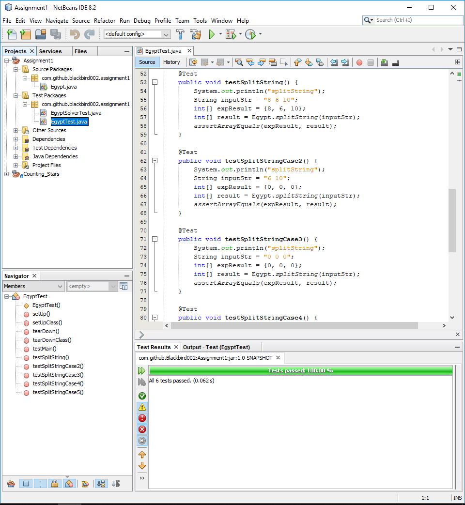
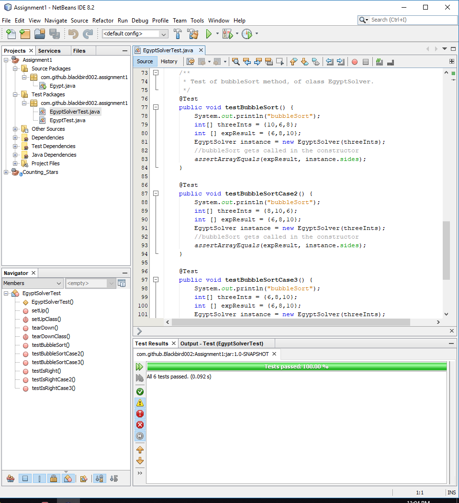

# CSCI310-CMU-Fall2018
Repository for CSCI 310 Java @ CMU

<h2>Welcome to Riad Shash (Ray's) CSCI 310 - Java Code Repository Dr. MacEvoy!</h2>

 

<h2>Assignment#1 is in the Assignment1 folder</h2>

 

The Kattis problem I solved is called "Egypt". Link: https://open.kattis.com/problems/egypt 

    Kattis Result:
    

    Junit test of the Egypt class (where main is located):
    

    Junit test of the EgyptSolver class:
    

